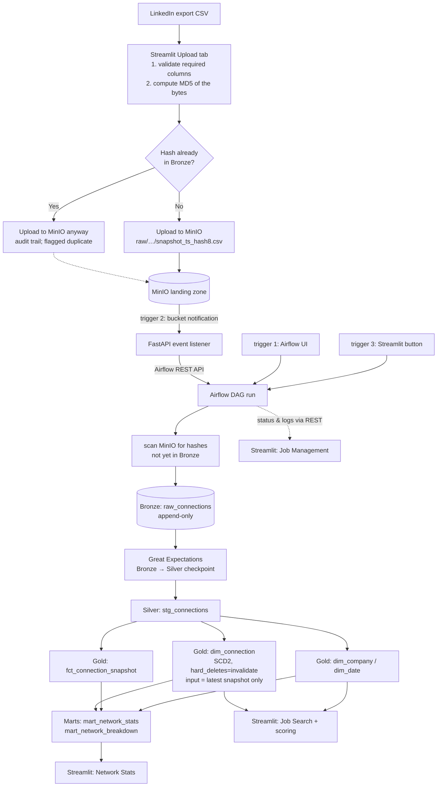

# Connection Lens

Turn a LinkedIn **"Connections"** data export into network analytics and
warm-intro signal, through a real event-driven data pipeline: MinIO landing
zone → Airflow → DuckDB → dbt (Silver/Gold/marts) → Streamlit.

> **Privacy first.** This is a private, single-user, **local-only** project. It
> processes real personal data (names, emails, profile URLs, employers), so no
> raw export, no warehouse file and no `.env` is ever committed, and nothing is
> ever sent to a third party. Data comes exclusively from LinkedIn's official
> *Get a copy of your data* export — there is no scraping of any kind. Every
> example, fixture and screenshot in this repository uses **synthetic** data.

---

## What it does

| | |
| --- | --- |
| **Network analytics** | How the network grew, which companies and titles it concentrates in, how many connections joined or left between exports. |
| **Warm-intro signal** | Who changed company or title recently, who works at a company you are targeting, and who is a recruiter, a hiring manager or a peer in your field. |
| **Portfolio artifact** | A testable, monitored, event-driven pipeline: idempotent ingestion, SCD Type 2 history, data-quality gates, and CI that proves the modelling rules still hold. |

## Architecture



**Stack:** DuckDB · MinIO · Airflow 3.1 · dbt-duckdb · Great Expectations ·
Streamlit · FastAPI · uv · pytest · sqlfluff · GitHub Actions.

---

## Quickstart

```bash
# 1. Python environment. Dependencies are locked in uv.lock and installed
#    into .venv — nothing lands system-wide.
#    (uv itself: https://docs.astral.sh/uv/getting-started/installation/)
make venv
make dbt-deps

# 2. Configuration: creates .env and pins AIRFLOW_UID to your user
make env
$EDITOR .env          # set the MinIO, Airflow and app-login credentials

# 3. Start the whole stack (MinIO + Airflow + Streamlit + event listener)
make up          # == docker compose up -d --build
```

| Service | URL | Notes |
| --- | --- | --- |
| Streamlit | <http://localhost:8501> | Upload, Network Stats, Job Search, Job Management. Sign in with `STREAMLIT_AUTH_USERNAME` / `STREAMLIT_AUTH_PASSWORD` |
| Airflow | <http://localhost:8080> | Credentials from `.env` |
| MinIO console | <http://localhost:9001> | Credentials from `.env` |

Then, in the app:

1. **Upload** — drop your `Connections.csv`. It is validated and hashed before
   anything is uploaded; the file lands in MinIO. This tab never starts
   ingestion.
2. **Job Management** — press *Trigger ingestion now*. Watch the run, its
   trigger source and its logs without leaving the app.
3. **Network Stats** / **Job Search** — read the results.

Prefer running the app outside Docker? `make app` serves it from `.venv`
against the same warehouse.

---

## Repository layout

```
connection_lens/
├── common/                     # shared, unit-tested building blocks
│   ├── csv_schema.py             # dynamic header detection + schema validation
│   ├── hashing.py                # the MD5 idempotency key
│   ├── naming.py                 # landing-zone object key convention
│   ├── minio_client.py           # landing zone (used by the app AND the DAG)
│   ├── duckdb_io.py              # read-only vs read-write connections, Bronze DDL
│   ├── bronze.py                 # scan → ingest → skip-duplicate logic
│   ├── data_quality.py           # the Great Expectations suite + checkpoint
│   ├── airflow_client.py         # REST wrapper (used by the app AND the listener)
│   ├── models.py                 # typed objects crossing layer boundaries
│   └── settings.py               # env-driven configuration, no hardcoded secrets
├── dags/ingest_connections_dag.py
├── dbt_project/
│   ├── models/staging/           # Silver  → schema `silver`
│   ├── models/marts/             # Gold + marts → schemas `gold` / `mart`
│   ├── snapshots/                # SCD2 dim_connection
│   ├── macros/                   # DuckDB-specific SQL, isolated
│   └── tests/                    # singular tests (SCD2 integrity, volume, share)
├── great_expectations/checkpoints/bronze_to_silver.py
├── services/minio_event_listener/main.py
├── streamlit_app/                # app.py + pages/ + auth.py + scoring.py + tagging.py + db.py
├── scripts/                      # CI fixture builder, SCD2 behaviour assertions
├── tests/                        # pytest, synthetic fixtures only
├── docker/                       # Dockerfiles for Airflow, Streamlit, listener
├── docker-compose.yml            # the whole local stack: MinIO, Airflow, app
├── pyproject.toml                # dependencies by group + tool config
├── uv.lock                       # the exact versions every environment gets
├── requirements.txt              # generated from uv.lock; what the images install
└── .github/workflows/ci.yml
```

---

## How ingestion decides what is new

**Idempotency is keyed on the MD5 of the file's bytes, checked against Bronze**
— never on the calendar date, the upload time, or which trigger fired the run.

| Situation | What happens |
| --- | --- |
| First upload | Lands in MinIO, ingested into Bronze, everyone gets a `dim_connection` row. |
| The exact same file again | Uploaded to MinIO again (the audit trail is deliberate), **skipped** in Bronze with a loud log line. |
| Different content, same day | Both ingested — the calendar day is irrelevant. |
| Someone changed employer | Their old SCD2 row is closed, a new current row opens. |
| Someone disappeared | Their row is invalidated (`dbt_valid_to` set, no longer current). **No reason is inferred or stored** — LinkedIn's export gives none. |
| Two triggers fire at once | `max_active_runs=1` serialises the runs; the second finds nothing pending and is a no-op. |
| Broken export (missing column) | Rejected in the browser before hashing or uploading. |

The DAG never branches on *which* trigger started it. It always rescans the
landing zone, so a redundant trigger is harmless by construction.

### The three trigger modes

| Mode | How | When to use |
| --- | --- | --- |
| **1 · Airflow UI** | Native *Trigger DAG* button | Debugging and ops |
| **2 · MinIO bucket event** | `s3:ObjectCreated:*` → FastAPI listener → Airflow REST | Fully event-driven; enable with `make minio-events` |
| **3 · Streamlit** | *Trigger ingestion now* button → Airflow REST | The day-to-day path |

Modes 2 and 3 tag the run with `conf.triggered_by`, which is what lets the Job
Management tab attribute each run — Airflow's own metadata cannot.

---

## Data model

| Layer | Model | Grain | Notes |
| --- | --- | --- | --- |
| Bronze | `bronze.raw_connections` | 1 row per connection per ingested export | Append-only, raw strings, written only by the DAG |
| Silver | `silver.stg_connections` | 1 row per connection per `snapshot_ts` | Cleaned and typed; no cross-snapshot comparison |
| Gold | `gold.dim_connection` | SCD2 version per connection | `strategy='check'` on `company` + `position`, `hard_deletes='invalidate'`, fed **only** the latest Silver snapshot |
| Gold | `gold.fct_connection_snapshot` | `connection_id` + `snapshot_ts` | Full history for growth/churn; a departed connection simply has no row |
| Gold | `gold.dim_company`, `gold.dim_date` | conformed dimensions | |
| Mart | `mart.mart_network_stats` | 1 row per snapshot | Growth, churn, coverage — the Network Stats tab reads this |
| Mart | `mart.mart_network_breakdown` | snapshot + dimension + value | Tidy distributions for the charts |

`connection_id` is the LinkedIn profile URL, kept exactly as exported
(percent-encoded); it is only `unquote`d for display. Names are not stable
enough to identify anyone.

---

## Testing, quality and CI

```bash
make check        # requirements drift + ruff + sqlfluff + pytest + dbt build
```

| Layer | What it checks |
| --- | --- |
| **pytest** | Hashing, dynamic header detection, schema validation, object-key parsing, the §14 idempotency scenarios, tagging, scoring, the Airflow REST client (mocked), the event listener, the Great Expectations suite |
| **dbt tests** | Uniqueness and not-null on every key, referential integrity, accepted values, SCD2 integrity, snapshot volume anomalies, identifiable-row share |
| **Great Expectations** | Bronze → Silver checkpoint: exact column set, metadata integrity, URL and date-format contracts |
| **Source freshness** | `dbt source freshness` warns when no new export has landed in 30 days |
| **sqlfluff** | Lints every model through the dbt templater |
| **CI** | Runs all of the above against a warehouse built from **synthetic fixtures**, parses the DAG under real Airflow, asserts the SCD2 rules still hold, and fails if a real export, warehouse file or `.env` is ever tracked |

The CI fixtures are two synthetic exports that differ by a company change, a
title change, a departure and two joiners — and by the **number of note lines
before the header**, so the dynamic header detection is exercised on every run.

There is deliberately **no** `not_null` rule on `email_address`: LinkedIn only
exports an email when the connection opted in, so most rows are blank by
design.

---

## Notes on the implementation

A few things worth knowing if you read the code:

* **`common/` exists because two runtimes need the same code.** The MinIO
  client is used by both the Streamlit upload flow and the Airflow DAG; the
  Airflow REST client is used by both Streamlit and the event listener.
  Hoisting them out of `streamlit_app/` keeps a single implementation and
  keeps both unit-testable.
* **One lockfile, one generated requirements file.** `uv.lock` pins every
  version; `make requirements` exports the runtime groups into the committed
  `requirements.txt` that all three images `pip install`, and CI fails if that
  file drifts from the lock. Airflow itself is deliberately absent from it —
  it comes from the base image, and reinstalling it from the lock moves Flask,
  Werkzeug and the OpenTelemetry stack out from under the providers already
  installed there. Airflow 3 and dbt do share one interpreter, which Airflow 2
  could not.
* **Restricted profiles.** A real export contains rows with *only* a
  connection date — LinkedIn's representation of a restricted or deactivated
  profile. They cannot be given a stable identity, so they are flagged in
  Silver, excluded from Gold, and **counted** in `mart_network_stats` rather
  than dropped silently. See [docs/data_quality.md](docs/data_quality.md).
* **Every tab is behind a login.** The app carries real names, employers and
  profile URLs, so `streamlit_app/auth.py` gates each page — including one
  opened directly by URL — against a single owner account read from `.env`.
  With no account configured the app fails closed instead of falling open.
* **Streamlit can never write to the warehouse.** It opens DuckDB read-only in
  code *and* mounts the warehouse read-only in Docker. Every write happens
  inside the DAG, which is what keeps DuckDB's single-writer constraint safe.

## Open items

* The job-search scoring weights are a starting point, not a finished formula.
  They live in one dataclass (`streamlit_app/scoring.py`) and every score
  carries its reasons, so tuning them is a one-line change.
* Company enrichment (industry, size) is undecided — and would have to come
  from a source that is not LinkedIn-scraped.
* Elementary OSS is not wired in; freshness and volume monitoring are currently
  covered by `dbt source freshness` and two singular tests.
