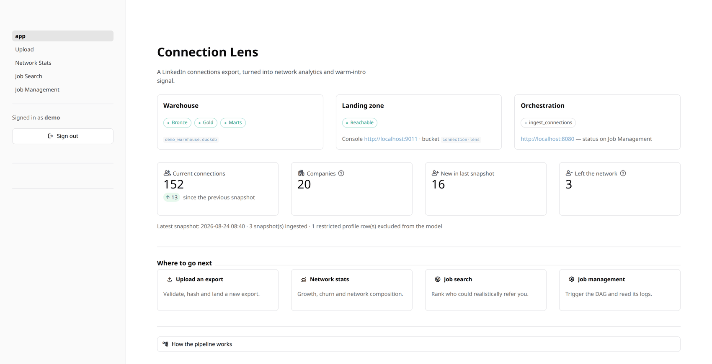
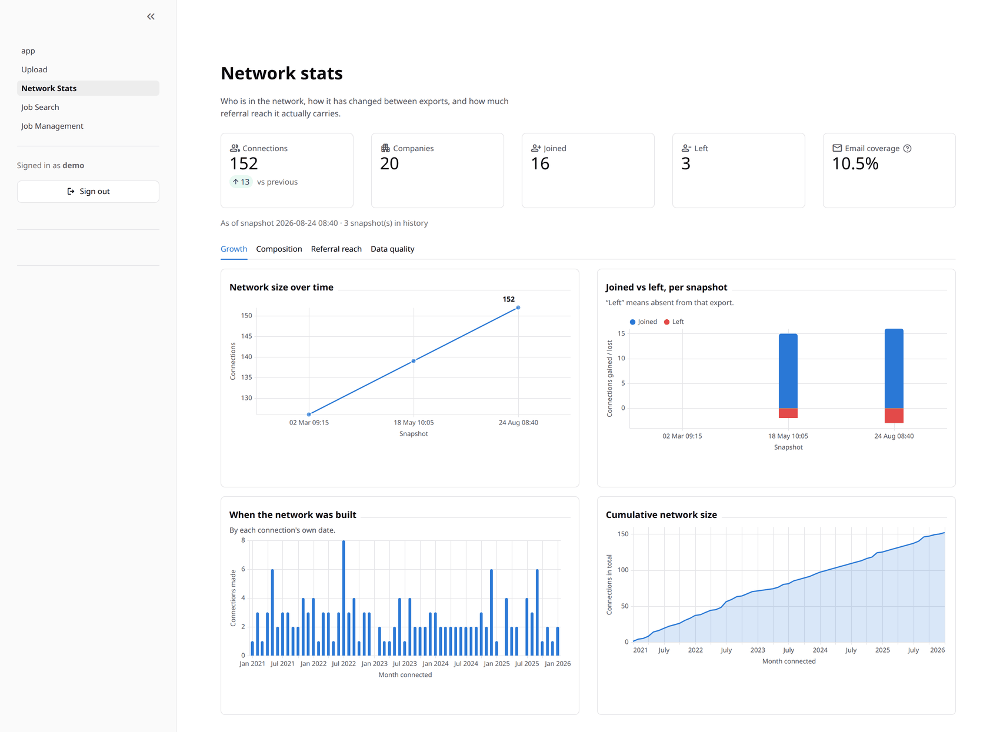
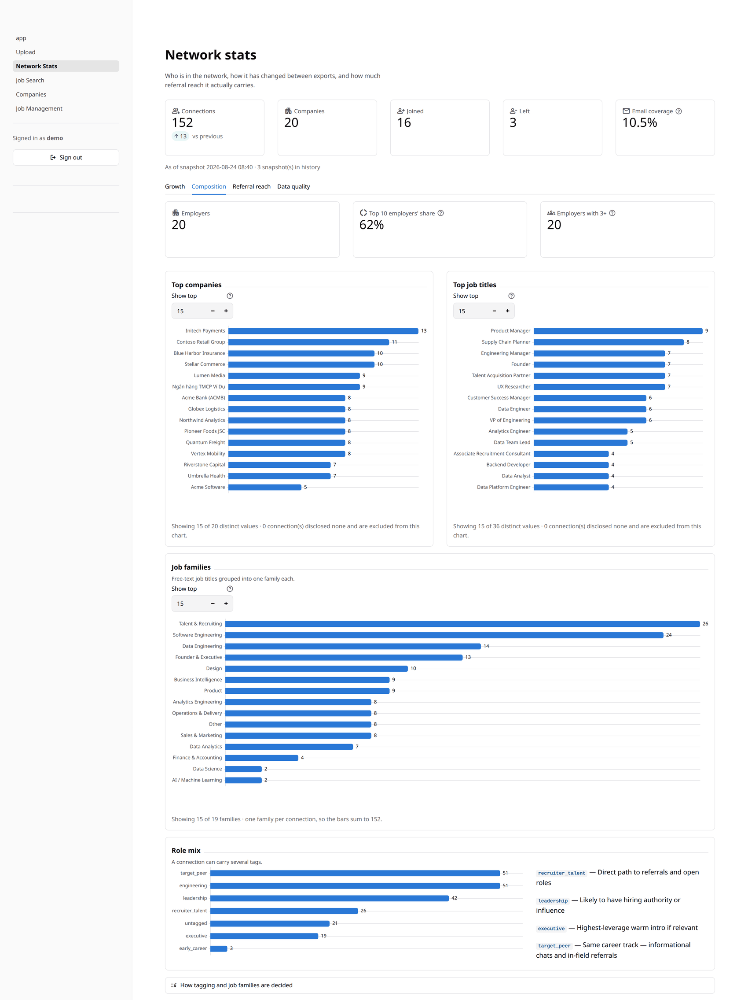
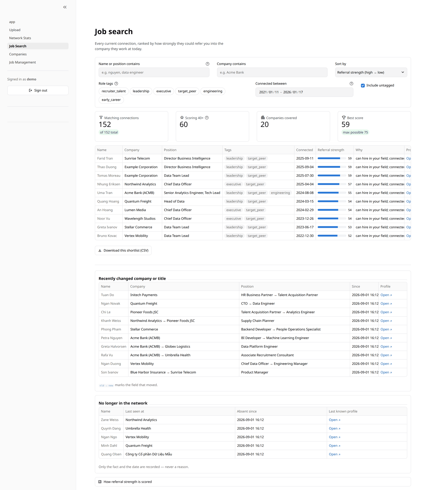
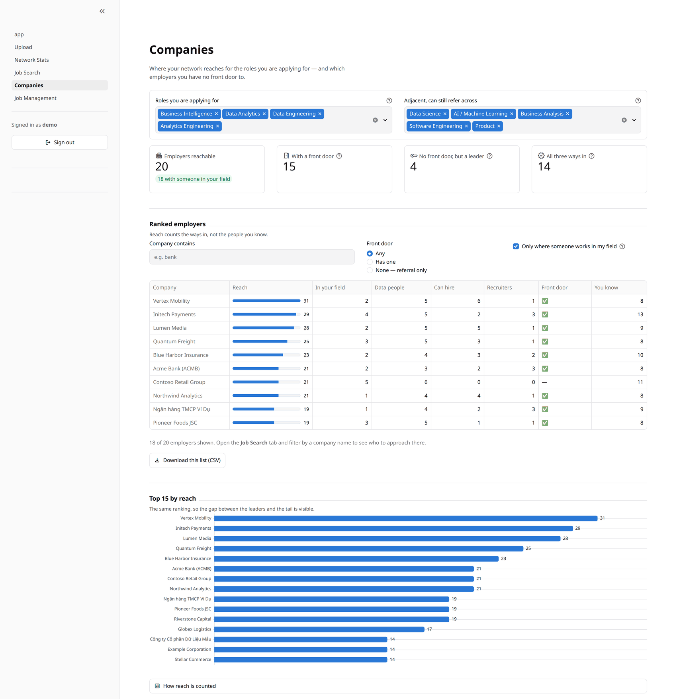
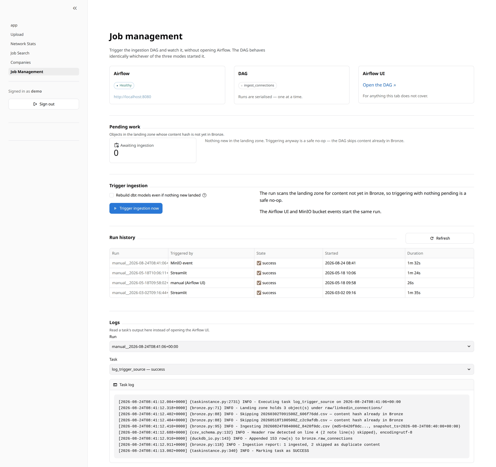
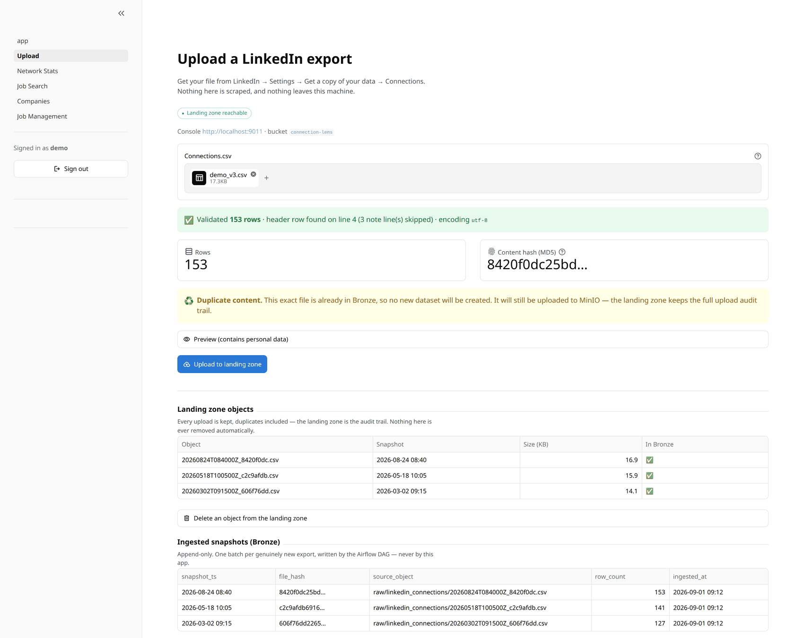
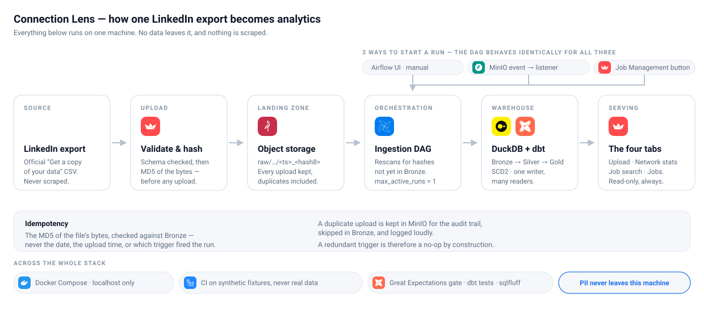
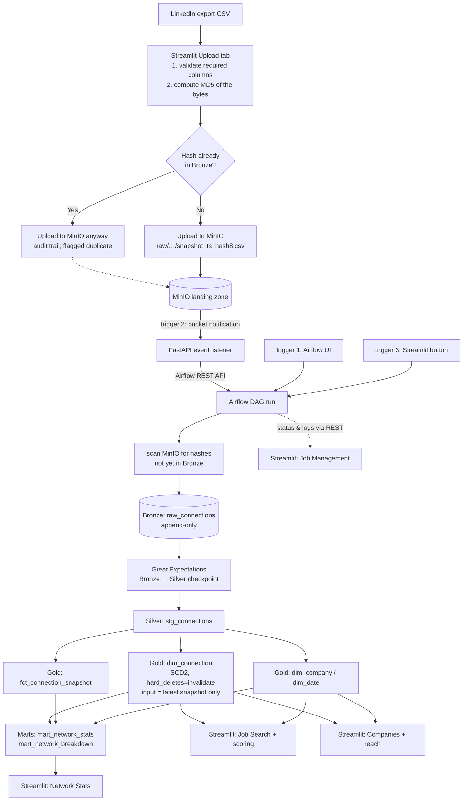

# Connection Lens

Turn a LinkedIn **"Connections"** data export into network analytics and
warm-intro signal, through a real event-driven data pipeline: MinIO landing
zone → Airflow → DuckDB → dbt (Silver/Gold/marts) → Streamlit.


> **Privacy first.** This is a private, single-user, **local-only** project. It
> processes real personal data (names, emails, profile URLs, employers), so no
> raw export, no warehouse file and no `.env` is ever committed, and nothing is
> ever sent to a third party. Data comes exclusively from LinkedIn's official
> *Get a copy of your data* export — there is no scraping of any kind. Every
> example, fixture and screenshot in this repository uses **synthetic** data.

---

## What it does

| | |
| --- | --- |
| **Network analytics** | How the network grew, which companies and titles it concentrates in, how many connections joined or left between exports. |
| **Warm-intro signal** | Who changed company or title recently, who works at a company you are targeting, and who is a recruiter, a hiring manager or a peer in your field. |
| **Portfolio artifact** | A testable, monitored, event-driven pipeline: idempotent ingestion, SCD Type 2 history, data-quality gates, and CI that proves the modelling rules still hold. |

---

## The app

> Every screenshot below is the real app, rendered against a **synthetic**
> warehouse: 152 invented connections across three snapshots.

### Overview — is the pipeline healthy, and how big is the network

Service health for all three moving parts (warehouse, landing zone,
orchestration), the headline numbers from the latest snapshot, and the way into
each tab.



### Network stats — growth, churn and composition

Growth over time and joiners vs leavers per snapshot, from
`mart_network_stats`; a departed connection simply has no fact row at that
snapshot.



The Composition tab breaks the network down by employer, job title, job family
and role tag — the same tagging function the Job Search tab scores with.



### Job search — who could realistically refer you

Every current connection, ranked by **how strongly they could refer you into a
role you actually apply for**, at the company they work at today. Everyone has
exactly one way in — they can hire in your field, they work in it, they recruit
for it, or they are adjacent to it — and the **Why** column always says which.
Below the ranking: who recently changed company or title, and who is no longer
in the network.



### Companies — where the network reaches, and where it does not

Job hunting picks an employer first and a person second, so this tab ranks
employers by how many ways into them you have: someone doing your job, someone
senior enough to open the role, an in-house recruiter. The families you apply
for are a control, not a constant — change them and the ranking moves with
them. Employers with **no front door** — no recruiter you know — are called
out, because a referral there is not a shortcut past the queue, it is the only
queue.



### Job management — trigger the DAG and read its logs

Airflow health, what is pending in the landing zone, the trigger button
(trigger mode 3), run history attributed by trigger source, and task logs —
without opening the Airflow UI.



### Upload — validate, hash, land

Validation and hashing happen **before** anything is uploaded. Here the file's
content hash is already in Bronze, so the tab says plainly that no new dataset
will be created — and uploads it to MinIO anyway, because the landing zone is
the audit trail.



---

## Architecture

<picture>
  <source media="(prefers-color-scheme: dark)" srcset="docs/images/architecture-dark.svg">
  
</picture>

The same flow in detail — every layer, model and trigger path:



**Stack:** DuckDB · MinIO · Airflow 3.1 · dbt-duckdb · Great Expectations ·
Streamlit · FastAPI · uv · pytest · sqlfluff · GitHub Actions.

---

## Running it from a fresh clone

```bash
git clone https://github.com/TungNamNguyen/connection_lens.git
cd connection_lens
```

**You need:** Docker Engine with the Compose v2 plugin, GNU Make, and
[uv](https://docs.astral.sh/uv/getting-started/installation/) (which brings its
own Python 3.12). uv is needed even if you only ever run the stack in Docker —
see step 1. The first `make up` pulls the Airflow, Postgres and MinIO images,
so budget a few GB and a few minutes.

### 1. Dependencies

```bash
make venv        # uv sync --frozen → .venv, nothing lands system-wide
make dbt-deps    # installs dbt_utils / dbt_expectations into dbt_project/dbt_packages
```

`make dbt-deps` is **not optional for the Docker path either**:
`dbt_project/` is bind-mounted into the Airflow containers and
`dbt_packages/` is git-ignored, so a fresh clone has no dbt packages and the
DAG's dbt tasks would fail. Nothing else installs them for you.

### 2. Configuration

```bash
make env         # copies .env.example → .env and pins AIRFLOW_UID to your user
$EDITOR .env
```

Compose refuses to start until these carry real values — it fails loudly,
naming the missing key, rather than booting half-configured:

| Key | Note |
| --- | --- |
| `MINIO_ROOT_USER` / `MINIO_ROOT_PASSWORD` | What the MinIO container boots with. Keep `MINIO_ACCESS_KEY` / `MINIO_SECRET_KEY` identical — that is what the app and the DAG sign in with. |
| `AIRFLOW_ADMIN_USERNAME` / `AIRFLOW_ADMIN_PASSWORD` | The admin user `airflow-init` creates. Keep `AIRFLOW_API_USERNAME` / `AIRFLOW_API_PASSWORD` identical — that is what Streamlit and the listener authenticate with. |
| `AIRFLOW_POSTGRES_PASSWORD` | Airflow's own metadata database. |
| `AIRFLOW_JWT_SECRET` | Signs the API tokens — `openssl rand -base64 32`. |
| `STREAMLIT_AUTH_USERNAME` / `STREAMLIT_AUTH_PASSWORD` | Your login to the app. Unset means the app refuses to render. |

`AIRFLOW_FERNET_KEY` can stay empty locally; set it if you want Airflow's
stored connections encrypted
(`python -c "from cryptography.fernet import Fernet; print(Fernet.generate_key().decode())"`).

### 3. Start the stack

```bash
make up          # creates data/warehouse, then docker compose up -d --build
make ps          # every service should be running / healthy
make logs        # tail the scheduler if something looks stuck
```

What happens on its own: the MinIO bucket is created and versioned by
`minio-init`, Airflow's database is migrated and its admin user created by
`airflow-init`, and the DAG registers **unpaused** — so a trigger runs
immediately. The DuckDB file does **not** exist yet; the first successful DAG
run creates it at `data/warehouse/warehouse.duckdb`.

| Service | URL | Notes |
| --- | --- | --- |
| Streamlit | <http://localhost:8501> | Upload, Network Stats, Job Search, Companies, Job Management. Sign in with `STREAMLIT_AUTH_USERNAME` / `STREAMLIT_AUTH_PASSWORD` |
| Airflow | <http://localhost:8080> | `AIRFLOW_ADMIN_USERNAME` / `AIRFLOW_ADMIN_PASSWORD` |
| MinIO console | <http://localhost:9001> | `MINIO_ROOT_USER` / `MINIO_ROOT_PASSWORD` |
| Event listener | <http://localhost:8000/health> | Trigger mode 2 only — MinIO posts bucket events here |

### 4. First ingestion

1. Open Streamlit and sign in.
2. **Upload** — drop your `Connections.csv`, from LinkedIn → Settings → *Get a
   copy of your data* → *Connections*. It is validated and hashed before
   anything is uploaded; the file lands in MinIO. This tab never starts
   ingestion.
3. **Job Management** — press *Trigger ingestion now*, then watch the run reach
   `success` and read its logs without leaving the app.
4. **Network Stats** / **Job Search** / **Companies** — populated as soon as
   that run finishes.

Optional, once per bucket: `make minio-events` wires MinIO bucket
notifications to the listener, so landing a file triggers ingestion by itself
(trigger mode 2).

### Working on the code

```bash
make check       # the full local gate, see "Testing, quality and CI" below
make app         # Streamlit from .venv against data/warehouse/warehouse.duckdb
make dbt-build   # dbt against the real warehouse (never while a DAG run is in flight —
                 # DuckDB has one writer, and the run owns it)
```

### Stopping and resetting

```bash
make down                            # stop everything; volumes and data are kept
docker compose down -v               # ...and delete the MinIO bucket and Airflow database
rm -rf data/warehouse                # ...and the warehouse itself
```

Deleting the warehouse is not the same as deleting your exports: whatever is
still in MinIO gets re-ingested on the next run, because idempotency is decided
by content hash against Bronze — and an empty Bronze means everything is new
again.

### Every configuration key

Everything configurable lives in `.env` (never committed) and is read through
`common/settings.py` — no credential or path is hardcoded anywhere. Copy
`.env.example`, which documents every key:

| Group | Keys | Used by |
| --- | --- | --- |
| MinIO | `MINIO_ENDPOINT`, `MINIO_ACCESS_KEY`, `MINIO_SECRET_KEY`, `MINIO_SECURE`, `MINIO_BUCKET`, `MINIO_RAW_PREFIX`, `MINIO_PUBLIC_URL` | Streamlit upload flow and the DAG's landing-zone scan |
| DuckDB | `DUCKDB_PATH` | Read-only in Streamlit, read-write in the DAG |
| Airflow REST | `AIRFLOW_API_BASE_URL`, `AIRFLOW_PUBLIC_URL`, `AIRFLOW_API_USERNAME`, `AIRFLOW_API_PASSWORD`, `AIRFLOW_DAG_ID`, `AIRFLOW_INGESTION_TASK_ID`, `AIRFLOW_API_TIMEOUT_SECONDS` | Job Management tab and the event listener |
| Event listener | `MINIO_EVENT_LISTENER_TOKEN`, `MINIO_EVENT_LISTENER_PORT` | Trigger mode 2 (optional) |
| App login | `STREAMLIT_AUTH_USERNAME`, `STREAMLIT_AUTH_PASSWORD` | The gate in front of every tab |
| dbt + logging | `DBT_PROJECT_DIR`, `DBT_PROFILES_DIR`, `DBT_TARGET`, `LOG_LEVEL` | The DAG's dbt tasks and every module's logger |
| Containers only | `MINIO_ROOT_USER`/`MINIO_ROOT_PASSWORD`, `AIRFLOW_ADMIN_*`, `AIRFLOW_UID`, `AIRFLOW_FERNET_KEY`, `AIRFLOW_JWT_SECRET`, `AIRFLOW_POSTGRES_PASSWORD` | Read by `docker-compose.yml` when the services boot, not by application code |

### Make targets

| Target | What it does |
| --- | --- |
| `make venv` / `make dbt-deps` | Install locked Python dependencies into `.venv`, then the dbt packages |
| `make env` | Create `.env` from the example and pin `AIRFLOW_UID` |
| `make up` / `make down` / `make ps` / `make logs` | Run, stop and inspect the Docker stack |
| `make app` | Run Streamlit from `.venv`, no Docker |
| `make minio-events` | Wire MinIO bucket notifications to the listener (trigger mode 2) |
| `make test` / `make lint` / `make format` | pytest; ruff + sqlfluff; auto-fix |
| `make ci-warehouse` | Build a throwaway warehouse from the synthetic fixtures |
| `make dag-check` | Parse the DAG under real Airflow and assert its guard rails |
| `make check` | Every gate CI runs, locally — minus CI's tracked-file privacy guard |
| `make dbt-build` / `make dbt-docs` | Run dbt against the real warehouse; browse the lineage graph |

---

## Repository layout

```
connection_lens/
├── common/                     # shared, unit-tested building blocks
│   ├── csv_schema.py             # dynamic header detection + schema validation
│   ├── hashing.py                # the MD5 idempotency key
│   ├── naming.py                 # landing-zone object key convention
│   ├── minio_client.py           # landing zone (used by the app AND the DAG)
│   ├── duckdb_io.py              # read-only vs read-write connections, Bronze DDL
│   ├── bronze.py                 # scan → ingest → skip-duplicate logic
│   ├── data_quality.py           # the Great Expectations suite + checkpoint
│   ├── airflow_client.py         # REST wrapper (used by the app AND the listener)
│   ├── models.py                 # typed objects crossing layer boundaries
│   ├── errors.py                 # the exception types every layer raises
│   └── settings.py               # env-driven configuration, no hardcoded secrets
├── dags/ingest_connections_dag.py
├── dbt_project/
│   ├── models/staging/           # Silver  → schema `silver`
│   ├── models/marts/             # Gold + marts → schemas `gold` / `mart`
│   ├── snapshots/                # SCD2 dim_connection
│   ├── macros/                   # DuckDB-specific SQL, isolated
│   └── tests/                    # singular tests (SCD2 integrity, volume, share)
├── great_expectations/checkpoints/bronze_to_silver.py
├── services/minio_event_listener/main.py
├── streamlit_app/                # app.py + pages/ + auth.py + db.py
│                                 # + tagging.py — job families and role tags, one taxonomy
│                                 # + scoring.py — per-person referral strength
│                                 # + companies.py — per-employer referral reach
│                                 # + upload_service.py / ui.py — validate-hash-land, shared chrome
│                                 # + theme.py / charts.py — one visual system for chrome and charts
├── .streamlit/config.toml        # app theme: colours, radii, fonts, heading scale
├── scripts/                      # CI fixture builder, SCD2 behaviour assertions
├── tests/                        # pytest, synthetic fixtures only
├── docs/                         # architecture decisions, data-quality rules
│   └── images/                   # architecture diagram + screenshots (synthetic data only)
├── docker/                       # Dockerfiles for Airflow, Streamlit, listener
├── docker-compose.yml            # the whole local stack: MinIO, Airflow, app
├── Makefile                      # every entrypoint below is a target here
├── .env.example                  # every configurable key, documented
├── data/warehouse/               # where the DuckDB file lives — git-ignored
├── pyproject.toml                # dependencies by group + tool config
├── uv.lock                       # the exact versions every environment gets
├── requirements.txt              # generated from uv.lock; what the images install
└── .github/workflows/ci.yml
```

---

## How ingestion decides what is new

**Idempotency is keyed on the MD5 of the file's bytes, checked against Bronze**
— never on the calendar date, the upload time, or which trigger fired the run.

| Situation | What happens |
| --- | --- |
| First upload | Lands in MinIO, ingested into Bronze, everyone gets a `dim_connection` row. |
| The exact same file again | Uploaded to MinIO again (the audit trail is deliberate), **skipped** in Bronze with a loud log line. |
| You delete an object from the Upload tab | Every version of it goes from MinIO. Bronze is untouched, so anything already ingested stays in the warehouse. The only way anything ever leaves the landing zone. |
| Different content, same day | Both ingested — the calendar day is irrelevant. |
| Someone changed employer | Their old SCD2 row is closed, a new current row opens. |
| Someone disappeared | Their row is invalidated (`dbt_valid_to` set, no longer current). **No reason is inferred or stored** — LinkedIn's export gives none. |
| Two triggers fire at once | `max_active_runs=1` serialises the runs; the second finds nothing pending and is a no-op. |
| Broken export (missing column) | Rejected in the browser before hashing or uploading. |

The DAG never branches on *which* trigger started it. It always rescans the
landing zone, so a redundant trigger is harmless by construction.

### The three trigger modes

| Mode | How | When to use |
| --- | --- | --- |
| **1 · Airflow UI** | Native *Trigger DAG* button | Debugging and ops |
| **2 · MinIO bucket event** | `s3:ObjectCreated:*` → FastAPI listener → Airflow REST | Fully event-driven; enable with `make minio-events` |
| **3 · Streamlit** | *Trigger ingestion now* button → Airflow REST | The day-to-day path |

Modes 2 and 3 tag the run with `conf.triggered_by`, which is what lets the Job
Management tab attribute each run — Airflow's own metadata cannot.

---

## Data model

| Layer | Model | Grain | Notes |
| --- | --- | --- | --- |
| Bronze | `bronze.raw_connections` | 1 row per connection per ingested export | Append-only, raw strings, written only by the DAG |
| Silver | `silver.stg_connections` | 1 row per connection per `snapshot_ts` | Cleaned and typed; no cross-snapshot comparison |
| Gold | `gold.dim_connection` | SCD2 version per connection | `strategy='check'` on `company` + `position`, `hard_deletes='invalidate'`, fed **only** the latest Silver snapshot |
| Gold | `gold.fct_connection_snapshot` | `connection_id` + `snapshot_ts` | Full history for growth/churn; a departed connection simply has no row |
| Gold | `gold.dim_company`, `gold.dim_date` | conformed dimensions | |
| Mart | `mart.mart_network_stats` | 1 row per snapshot | Growth, churn, coverage — the Network Stats tab reads this |
| Mart | `mart.mart_network_breakdown` | snapshot + dimension + value | Tidy distributions for the charts |

`connection_id` is the LinkedIn profile URL, kept exactly as exported
(percent-encoded); it is only `unquote`d for display. Names are not stable
enough to identify anyone.

---

## Testing, quality and CI

```bash
make check        # requirements drift + ruff + sqlfluff + pytest
                  # + dbt build on synthetic fixtures + DAG parse
```

| Layer | What it checks |
| --- | --- |
| **pytest** | Hashing, dynamic header detection, schema validation, object-key parsing, every documented ingestion/idempotency scenario, tagging, per-person scoring, per-employer reach, the login gate, the Airflow REST client (mocked), the event listener, the Great Expectations suite, and page smoke tests that prove the app still reads a warehouse read-only |
| **dbt tests** | Uniqueness and not-null on every key, referential integrity, accepted values, and six singular tests: SCD2 integrity, one Bronze batch per snapshot, fact-to-dimension coverage, company counts agreeing, snapshot volume anomalies, identifiable-row share |
| **Great Expectations** | Bronze → Silver checkpoint: exact column set, metadata integrity, URL and date-format contracts |
| **Source freshness** | `dbt source freshness`, run by the DAG: warns after 30 days without a new export, errors after 90 |
| **sqlfluff** | Lints every model through the dbt templater |
| **CI** | Runs all of the above against a warehouse built from **synthetic fixtures** (with coverage), parses the DAG under real Airflow to assert `max_active_runs=1`, no schedule and no catchup, asserts the SCD2 rules still hold, and fails if a real export, warehouse file, `.env` or MinIO volume is ever tracked |

The CI fixtures are two synthetic exports that differ by a company change, a
title change, a departure and two joiners — and by the **number of note lines
before the header**, so the dynamic header detection is exercised on every run.

There is deliberately **no** `not_null` rule on `email_address`: LinkedIn only
exports an email when the connection opted in, so most rows are blank by
design.

---

## Documentation

| Document | What it covers |
| --- | --- |
| [docs/architecture_decisions.md](docs/architecture_decisions.md) | Why each choice was made — DuckDB over a cloud warehouse, hash-based idempotency, SCD2 with `hard_deletes`, the owner-initiated delete exception |
| [docs/data_quality.md](docs/data_quality.md) | Every rule that came from looking at a real export: restricted profiles, blank emails, diacritics, the schema contract |

---

## Troubleshooting

| Symptom | Cause and fix |
| --- | --- |
| The app says *Login is not configured* | `STREAMLIT_AUTH_USERNAME` / `STREAMLIT_AUTH_PASSWORD` are unset. The gate fails closed on purpose — set both in `.env` and restart. |
| *No snapshots ingested yet* after uploading | Uploading never triggers ingestion. Go to Job Management and press *Trigger ingestion now*. |
| *Ingestion running* on every tab | The DAG holds DuckDB's single write lock while it runs; the tabs say so instead of guessing. It clears when the run finishes. |
| A trigger did nothing | Expected when no landing-zone object has a hash missing from Bronze. Tick *Rebuild dbt models even if nothing new landed* to rerun the transforms anyway. |
| Job Management says *Airflow unreachable* | The Airflow stack is not up (`make up`), or `AIRFLOW_API_*` in `.env` does not match the admin user created by `airflow-init`. |
| Bucket events never fire | Trigger mode 2 needs `make minio-events` once per bucket, plus a running `minio-event-listener`. |
| `make check` fails on requirements drift | `pyproject.toml`/`uv.lock` changed without regenerating — run `make requirements`. |
| A page throws `ImportError: cannot import name …` after you pull | The source is bind-mounted, so the file in the container is already current — but the running Streamlit process still holds the module it imported at start-up, and Streamlit only re-executes the page script, not its imports. `docker compose restart streamlit`. A rebuild is only needed when `requirements.txt` changed. |

---

## Open items

* The job-search scoring weights are a starting point, not a finished formula.
  They live in one dataclass (`streamlit_app/scoring.py`) and every score
  carries its reasons, so tuning them is a one-line change.
* Company enrichment (industry, size) is undecided — and would have to come
  from a source that is not LinkedIn-scraped.
* Elementary OSS is not wired in; freshness and volume monitoring are currently
  covered by `dbt source freshness` and two singular tests.

---

## License

None granted. This is a personal, private tool published for review rather than
reuse; there is no `LICENSE` file, so default copyright applies.
