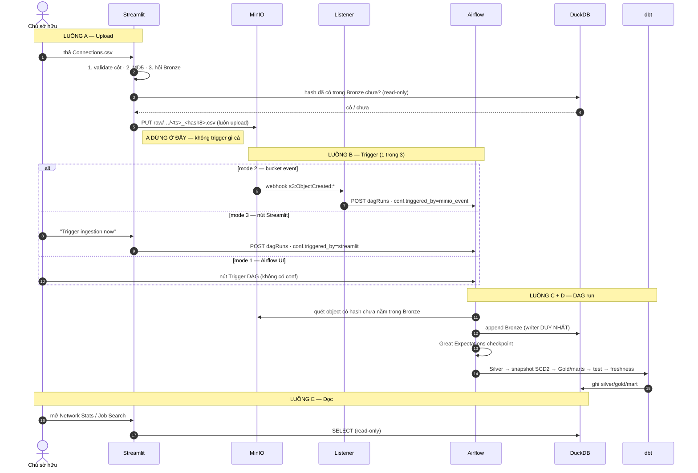

# Luồng chạy và các chế độ vận hành

Tài liệu này trả lời câu hỏi **"lúc chạy thật thì chuyện gì xảy ra, theo thứ tự
nào, và ở chế độ nào?"**. Nó bổ sung cho:

* [`build_guide.md`](build_guide.md) — dựng dự án theo thứ tự nào;
* [`architecture_decisions.md`](architecture_decisions.md) — vì sao chọn như vậy;
* [`data_quality.md`](data_quality.md) — luật rút ra từ export thật.

---

## Mục lục

1. [Bản đồ tổng thể](#1-bản-đồ-tổng-thể)
2. [Luồng A — Upload](#2-luồng-a--upload-trình-duyệt--minio)
3. [Luồng B — Trigger (3 chế độ)](#3-luồng-b--trigger-3-chế-độ)
4. [Luồng C — DAG run](#4-luồng-c--dag-run-từng-task-một)
5. [Luồng D — dbt](#5-luồng-d--dbt-silver--gold--marts)
6. [Luồng E — Đọc/serving](#6-luồng-e-đọcserving)
7. [Toàn bộ các mode quan trọng](#7-toàn-bộ-các-mode-quan-trọng)
8. [Ma trận no-op — khi nào không có gì xảy ra](#8-ma-trận-no-op--khi-nào-không-có-gì-xảy-ra)
9. [Failure mode — hỏng ở đâu thì mất gì](#9-failure-mode--hỏng-ở-đâu-thì-mất-gì)
10. [Ba timeline ví dụ](#10-ba-timeline-ví-dụ)

---

## 1. Bản đồ tổng thể

Năm luồng nối tiếp nhau, nhưng **chúng không đồng bộ với nhau**: A dừng ở MinIO,
B mới đánh thức C, và E đọc bất cứ thứ gì D để lại.



**Ba ranh giới không được vượt qua:**

| Ranh giới | Luật |
| --- | --- |
| Streamlit ↔ warehouse | Chỉ đọc. Cưỡng chế **hai lớp**: `connect_read_only()` trong code, và mount `:ro` trong Docker |
| Trigger ↔ DAG | DAG **không bao giờ rẽ nhánh** theo nguồn trigger |
| MinIO ↔ Bronze | MinIO giữ mọi bản trùng; Bronze mới là dataset of record |

---

## 2. Luồng A — Upload (trình duyệt → MinIO)

Trang [`1_Upload.py`](../streamlit_app/pages/1_Upload.py), logic thuần nằm ở
[`upload_service.py`](../streamlit_app/upload_service.py).

**Thứ tự là một hợp đồng, không phải sở thích:**

```
bytes file
   │
   ├─1─► parse_export()          validate TRƯỚC — thiếu cột thì dừng tại đây,
   │                              chưa hash, chưa upload gì cả
   ├─2─► md5_bytes()             khóa idempotency, tính ở client
   ├─3─► db.is_hash_in_bronze()  hỏi BRONZE, không hỏi MinIO
   └─4─► client.put_export()     upload trong CẢ HAI trường hợp
```

### Bước 1 chi tiết — vì sao validate trước

Một file thiếu cột bắt buộc **không bao giờ chạm tới MinIO**. Nếu hash trước rồi
mới validate, landing zone sẽ tích rác mà không lớp nào dọn.

Ba việc `parse_export()` làm:

| Việc | Chi tiết |
| --- | --- |
| Decode | `utf-8` → `utf-8-sig` → `latin-1`. Trường công ty/chức danh có dấu tiếng Việt |
| Dò header | Quét tìm dòng bắt đầu bằng `first name,last name`. **Không bao giờ `skiprows`** — số dòng note không cố định giữa các phiên bản export |
| Validate | Thiếu cột bắt buộc **hoặc** có cột lạ đều là invalid → `CsvSchemaError` |

UI hiển thị đúng những gì nó phát hiện được: số dòng, header ở dòng thứ mấy, bỏ
qua bao nhiêu dòng note, encoding nào. Đó là bằng chứng cho người dùng rằng việc
dò header thật sự đã chạy.

### Bước 3 chi tiết — hỏi Bronze, không hỏi MinIO

MinIO **cố ý** chứa bản trùng để giữ audit trail upload. Hỏi nó "file này có
chưa" sẽ luôn ra câu trả lời sai về mặt nghiệp vụ. Câu hỏi đúng là *"nội dung này
đã thành dataset chưa"* — và chỉ Bronze trả lời được.

### Bước 4 — hai kết cục, cả hai đều upload

| Trường hợp | Object lên MinIO? | Thông điệp cho người dùng |
| --- | --- | --- |
| Nội dung mới | ✅ | "New content — sẽ thành snapshot mới khi được ingest" |
| Trùng Bronze | ✅ | "Duplicate content — sẽ **không** có dataset mới. Vẫn upload để audit trail đầy đủ" |

Tab này **không có nút trigger**. Cả ba chế độ trigger được tập trung ở tab Job
Management, để không có đường tắt nào lách qua chúng.

### Xóa object (thao tác một chiều)

Tab Upload có mục xóa object khỏi landing zone, cố tình đặt trong expander, cần
tick xác nhận, và cảnh báo khác nhau theo trạng thái:

* **đã ingest** → xóa chỉ mất bản trong landing zone, Bronze vẫn giữ dữ liệu;
* **chưa từng ingest** → xóa là **mất hẳn export đó**, không còn bản nào ở đâu.

---

## 3. Luồng B — Trigger (3 chế độ)

Cả ba đổ về **cùng một DAG**, và DAG hành xử y hệt nhau.

| | Mode 1 — Airflow UI | Mode 2 — Bucket event | Mode 3 — Nút Streamlit |
| --- | --- | --- | --- |
| Ai kích | Người, trong Airflow | MinIO, tự động | Người, trong app |
| Đường đi | Native | MinIO → listener → REST | Streamlit → REST |
| `conf.triggered_by` | *(không có)* | `minio_event` | `streamlit` |
| Hiện trên Job Management | `manual (Airflow UI)` | `MinIO event` | `Streamlit` |
| Dùng khi | Debug, vận hành | Event-driven đầy đủ | **Đường chính hằng ngày** |

### `triggered_by` để làm gì — và không để làm gì

```python
# trong DAG
source = extract_triggered_by(dag_run.conf or {})
logger.info("DAG run %s triggered by: %s. This value is logged only …", ...)
```

Nó **chỉ đi vào log và vào bảng lịch sử run**. Metadata của Airflow không diễn
đạt được "vì sao run này xảy ra", nên dự án tự tag. DAG rẽ nhánh theo nó là
anti-pattern được liệt kê rõ ở §17.

Khi `conf` trống, `extract_triggered_by()` trả về nhãn `manual (Airflow UI)` —
đó chính là cách mode 1 được nhận diện: **bằng sự vắng mặt**, không cần Airflow
hỗ trợ gì thêm.

### Mode 2 chi tiết — vì sao cần một service riêng

```
MinIO --webhook JSON--> listener --REST + JWT--> Airflow
```

Hai lý do, cả hai đều không vá được:

1. payload webhook của MinIO không có hình dạng mà API Airflow chờ đợi;
2. MinIO không gắn được header auth của Airflow (JWT) vào request.

Listener lọc hai lớp trước khi gọi Airflow: bỏ mọi event không phải
`s3:ObjectCreated:*`, và bỏ mọi key ngoài prefix landing zone. Object key được
gửi kèm là **metadata thuần** — DAG không bao giờ đọc nó.

### Mode 3 chi tiết — nút trong app

```python
run = client.trigger_dag_run(
    TriggerSource.STREAMLIT,
    conf_extra={"force_transform": force_transform},
    note="Triggered from the Connection Lens Job Management tab.",
)
```

Tab này còn hiển thị **"Objects awaiting ingestion"** trước nút bấm, nên người
dùng biết trước run sắp tới sẽ làm gì hay sẽ là no-op.

### Xác thực với Airflow 3

Airflow 3 dùng `/api/v2` + JWT, không phải basic auth:

```
POST /auth/token {username, password}  →  access_token (cache lại)
mọi request:  Authorization: Bearer <token>
401/403       →  bỏ token, lấy mới, retry ĐÚNG MỘT LẦN
5xx khi lấy token →  retry vài lần (apiserver mới khởi động, FAB chưa sẵn sàng)
4xx khi lấy token →  fail ngay (sai credential thì retry vô ích)
```

---

## 4. Luồng C — DAG run (từng task một)

[`dags/ingest_connections_dag.py`](../dags/ingest_connections_dag.py) —
`schedule=None`, `catchup=False`, `max_active_runs=1`, retry 2 lần cách nhau 2
phút, timeout 30 phút.

```
log_trigger_source ──► scan_landing_zone ──► ingest_new_objects_to_bronze
                                                    │
                                    ┌───────────────┴───────────────┐
                                    ▼                               ▼
                          log_ingestion_summary            has_new_data (short-circuit)
                          (LUÔN chạy)                               │ true
                                                                    ▼
                                                          validate_bronze_batch
                                                                    │
                                                                    ▼
                                                       ┌─ transform_with_dbt ─┐
                                                       │ silver               │
                                                       │ snapshot             │
                                                       │ gold + marts         │
                                                       │ test                 │
                                                       │ source freshness     │
                                                       └──────────────────────┘
```

| Task | Đọc gì | Ghi gì | Ghi chú |
| --- | --- | --- | --- |
| `log_trigger_source` | `dag_run.conf` | log | Không ảnh hưởng control flow |
| `scan_landing_zone` | MinIO + Bronze | XCom: danh sách object pending | Mở connection **read-write** để `ensure_bronze()` |
| `ingest_new_objects_to_bronze` | MinIO (bytes) | **Bronze** | Writer duy nhất của dự án |
| `log_ingestion_summary` | XCom | log | **Ngoài** nhánh short-circuit — run no-op vẫn phải nói rõ nó skip gì |
| `has_new_data` | XCom + params | — | `@task.short_circuit` |
| `validate_bronze_batch` | Bronze (read-only) | log | Great Expectations |
| `transform_with_dbt` | Bronze/Silver | silver/gold/mart | 5 task `@task.bash` nối tiếp |

### `scan_landing_zone` — lọc hai tầng

```python
# tầng 1 — rẻ, không tải file: so 8 ký tự hash trong TÊN object
pending = [obj for obj in landing_objects if obj.hash8 not in ingested_short]

# tầng 2 — trong ingest_object(), SAU khi tải bytes về:
file_hash = md5_bytes(raw)
if short_hash(file_hash) != landing_object.hash8:
    raise IngestionError(...)      # tên object nói dối về nội dung → từ chối
if hash_in_bronze(connection, file_hash):
    return ...status="skipped_duplicate"
```

Tầng 2 là **phòng thủ theo chiều sâu**: DAG không tin tầng app đã tính hash
đúng. Và nếu hash thật không khớp hash trong tên, nó **từ chối nạp** thay vì
đoán — nội dung bị đổi hoặc object bị đặt sai tên đều là lỗi, không phải chuyện
để im lặng cho qua.

### `has_new_data` — cổng short-circuit

| Có object mới? | `force_transform` | Kết quả |
| --- | --- | --- |
| Có | bất kỳ | Chạy tiếp toàn bộ |
| Không | `false` *(mặc định)* | **Dừng ở đây** — run là no-op có chủ đích |
| Không | `true` | Chạy tiếp, rebuild Silver/Gold từ Bronze sẵn có |

`ignore_downstream_trigger_rules=True` khiến toàn bộ nhánh dưới được đánh dấu
skipped chứ không phải failed — một run no-op hiện màu xanh trong Airflow, đúng
với ý nghĩa của nó.

### Vì sao `log_ingestion_summary` nằm ngoài cổng

Nếu nó nằm sau short-circuit, thì đúng cái run "tôi upload lại file cũ" — run mà
người dùng cần biết chuyện gì đã xảy ra nhất — lại là run **không log gì cả**.
"Không bao giờ skip im lặng" (§17) đòi hỏi tóm tắt phải nằm ngoài cổng.

---

## 5. Luồng D — dbt (Silver → Gold → marts)

Năm lệnh bash nối tiếp trong task group, mỗi lệnh tự chứa đủ biến môi trường:

```bash
env DUCKDB_PATH=… DBT_TARGET=dev DBT_TARGET_PATH=/tmp/dbt_target DBT_LOG_PATH=/tmp/dbt_logs \
    dbt <subcommand> --project-dir … --profiles-dir …
```

| # | Lệnh | Ra cái gì |
| --- | --- | --- |
| 1 | `run --select path:models/staging` | `silver.stg_connections` |
| 2 | `snapshot` | `gold.dim_connection` (SCD2) |
| 3 | `run --select path:models/marts` | `gold.dim_company`, `gold.dim_date`, `gold.fct_connection_snapshot`, `mart.mart_network_stats`, `mart.mart_network_breakdown` |
| 4 | `test` | Generic + 5 singular test |
| 5 | `source freshness` | Cảnh báo nếu 30 ngày không có export mới |

**Thứ tự 1 → 2 → 3 là bắt buộc**, không phải để cho đẹp: snapshot đọc Silver, còn
`fct_connection_snapshot` và các mart đọc Silver + snapshot.

### Chuyện gì xảy ra với một người cụ thể

Giả sử **Lan** ở snapshot mới nhất:

| Tình huống của Lan | `stg_connections` | `dim_connection` (SCD2) | `fct_connection_snapshot` |
| --- | --- | --- | --- |
| Mới xuất hiện | 1 dòng | dòng mới, `is_current=true` | 1 dòng ở snapshot này |
| Không đổi gì | 1 dòng | không đổi | thêm 1 dòng ở snapshot này |
| Đổi công ty | 1 dòng (công ty mới) | dòng cũ đóng `dbt_valid_to`, mở dòng mới | 1 dòng, công ty mới |
| **Biến mất** | không có dòng | `hard_deletes='invalidate'` đóng dòng, hết `is_current` | **không có dòng** ở snapshot này |
| Profile bị hạn chế (chỉ có ngày) | 1 dòng, `is_identifiable=false` | **bị loại** | **bị loại**, nhưng được **đếm** ở `mart_network_stats` |

Với người biến mất, hệ thống ghi lại **sự kiện biến mất**, tuyệt đối không ghi
**lý do**. Export của LinkedIn không cho tín hiệu nào để phân biệt "họ unlink",
"chủ tài khoản gỡ", hay "tài khoản bị vô hiệu hóa" — đoán một trong ba là đặt
sự thật bịa đặt trước một quyết định outreach thật.

### Hai config của snapshot, và cái gì hỏng nếu bỏ

| Config | Bỏ đi thì sao |
| --- | --- |
| `hard_deletes='invalidate'` | Người rời network mãi mãi `is_current=true`. Câu hỏi "ai đã rời" thành không trả lời được |
| Input lọc `snapshot_ts = max(snapshot_ts)` | `strategy='check'` diff input với trạng thái hiện tại; cho ăn cả lịch sử sẽ phá vỡ logic diff |

---

## 6. Luồng E — Đọc/serving

Toàn bộ đi qua [`streamlit_app/db.py`](../streamlit_app/db.py), luôn dùng
`connect_read_only`, có cache của Streamlit, và `safe_query()` trả DataFrame
**rỗng** thay vì nổ khi warehouse chưa tồn tại.

| Tab | Đọc | Xử lý ở Python |
| --- | --- | --- |
| Overview (`app.py`) | Trạng thái warehouse/MinIO/Airflow | — |
| Upload | `bronze.raw_connections` (hash + log ingest) | — |
| Network Stats | `mart_network_stats`, `mart_network_breakdown` | Chỉ vẽ chart |
| Job Search | `gold.dim_connection`, `gold.dim_company` | **Tagging + scoring** |
| Job Management | Airflow REST (không chạm warehouse) | — |

### Vì sao Job Search tính điểm ở Python chứ không ở SQL

Ba lý do, theo thứ tự quan trọng:

1. **Tương tác** — lọc và sắp xếp lại không cần chạy lại pipeline;
2. **Test được** — taxonomy và trọng số là hàm thuần, pytest kiểm trực tiếp;
3. **Một nguồn sự thật** — nhân đôi danh sách keyword sang SQL là bảo đảm sẽ
   lệch nhau. `mart_network_breakdown` **cố tình không có** cột role tag vì lý do này.

### Điểm referral — thuộc tính của con người, không phải của ô nhập liệu

`score_referral()` trả lời đúng một câu hỏi: **người này giới thiệu tôi vào công
ty họ đang làm mạnh tới đâu?** Không cần nhập target company, không cần cấu hình
— mở tab lên là thứ hạng đã có nghĩa.

| Thành phần | Điểm |
| --- | --- |
| Vai trò mạnh nhất (recruiter 40 / executive 35 / leadership 30 / peer 25 / engineering 20) | tag mạnh nhất được tính |
| Có tag vai trò thứ hai | +10 |
| Tín hiệu thâm niên trong chức danh | +15 |
| Kết nối trong vòng 12 tháng | +20 |
| Có email (liên hệ được không cần InMail) | +15 |
| Đang giai đoạn đầu sự nghiệp | **−20** |
| Không có công ty trong export | trả về 0 ngay — không có nơi nào để giới thiệu |

Mỗi điểm số mang theo **danh sách lý do**, hiển thị ngay trên bảng. Một con số
không bao giờ được tin tưởng suông trước một quyết định outreach thật.

Hai thứ **cố tình không** được chấm điểm:

* **độ mới của lần đổi công ty/chức danh** — tín hiệu này cần vài export mới có
  nghĩa; trước đó nó kích hoạt như nhau cho tất cả mọi người, tức là không xếp
  hạng được gì;
* **target company gõ tay** — sức mạnh giới thiệu thuộc về công ty đã có sẵn
  trong export, và bộ lọc company làm nốt phần còn lại.

---

## 7. Toàn bộ các mode quan trọng

### 7.1 Ba chế độ trigger

Xem [mục 3](#3-luồng-b--trigger-3-chế-độ). Bật mode 2:

```bash
# .env
MINIO_WEBHOOK_ENABLE=on
MINIO_EVENT_LISTENER_TOKEN=<một chuỗi bí mật>

make up && make minio-events
```

Bỏ qua mode 2 hoàn toàn vẫn được — dự án chạy đủ chức năng với mode 1 + 3.

### 7.2 Chế độ truy cập DuckDB — một writer, nhiều reader

| Chế độ | Ai dùng | Cưỡng chế bằng |
| --- | --- | --- |
| Read-write | **Chỉ** Airflow DAG | `connect_read_write()` |
| Read-only | Streamlit, `validate_bronze_batch` | `connect_read_only()` + mount `:ro` trong Docker |

Cộng với `max_active_runs=1`, đây là toàn bộ lý do DuckDB single-writer không
gây rắc rối dù có tới 3 nguồn trigger.

Cưỡng chế **hai lớp** là có chủ đích: nếu ai đó sửa code Streamlit thành
`read_only=False`, mount `:ro` vẫn chặn được.

### 7.3 `force_transform` — bật/tắt

| Giá trị | Ý nghĩa | Dùng khi |
| --- | --- | --- |
| `false` *(mặc định)* | Không có gì mới → dừng sau ingestion | Chạy hằng ngày |
| `true` | Rebuild Silver/Gold từ Bronze sẵn có | Vừa sửa model dbt, muốn build lại mà không cần export mới |

Đặt được ở cả nút Streamlit (checkbox) lẫn form trigger của Airflow UI (`Param`).

### 7.4 dbt target — `dev` vs `ci`

| Target | `DUCKDB_PATH` | Threads | Ai chạy |
| --- | --- | --- | --- |
| `dev` | Warehouse thật | 4 | DAG, `make dbt-build` |
| `ci` | `build/ci_warehouse.duckdb` | 2 | GitHub Actions, `make ci-warehouse` |

Cả hai đều **bắt buộc** có `DUCKDB_PATH`, không có giá trị mặc định — fail to còn
hơn âm thầm tạo một warehouse thứ hai ở chỗ không ai ngờ.

### 7.5 Chế độ chạy app — Docker vs venv

| | `make up` | `make app` |
| --- | --- | --- |
| Chạy gì | Cả stack (MinIO + Airflow + app + listener) | Chỉ Streamlit, từ `.venv` |
| Warehouse | Mount `:ro` | Cùng file, `connect_read_only` |
| Dùng khi | Vận hành bình thường | Sửa UI nhanh, không cần rebuild image |

### 7.6 Chế độ xác thực — fail closed

| Lớp | Biến | Chưa cấu hình thì sao |
| --- | --- | --- |
| Đăng nhập app | `STREAMLIT_AUTH_USERNAME/PASSWORD` | **App không render gì cả** |
| Airflow REST | `AIRFLOW_API_USERNAME/PASSWORD` | Tab Job Management dừng kèm thông báo rõ |
| MinIO | `MINIO_ACCESS_KEY/SECRET_KEY` | Tab Upload dừng, báo landing zone không dùng được |
| Listener | `MINIO_EVENT_LISTENER_TOKEN` | Token rỗng = **bỏ kiểm tra** (tiện lợi local) |

Ba dòng đầu fail **closed**. Dòng cuối là ngoại lệ duy nhất, và chỉ chấp nhận
được vì listener chỉ nằm trong mạng Docker nội bộ.

### 7.7 Chế độ nội dung — mới vs trùng

Quyết định ở đúng một chỗ: **MD5 của bytes, đối chiếu Bronze**.

| | Nội dung mới | Nội dung trùng |
| --- | --- | --- |
| Lên MinIO | ✅ | ✅ *(audit trail — có chủ đích)* |
| Vào Bronze | ✅ | ❌ skip, kèm log có `md5=` |
| Chạy dbt | ✅ | ❌ short-circuit |

Không bao giờ theo ngày lịch, giờ upload, hay trigger nào đã kích run.

### 7.8 Chế độ DAG paused

DAG khai `is_paused_upon_creation=False`. Nếu bị pause thủ công, run được trigger
sẽ **xếp hàng nhưng không bao giờ chạy** — tab Job Management phát hiện và hiển
thị nút "Unpause the DAG" ngay tại chỗ, thay vì để người dùng ngồi chờ một run
không bao giờ bắt đầu.

---

## 8. Ma trận no-op — khi nào không có gì xảy ra

Một hệ thống có 3 nguồn trigger phải khiến việc trigger thừa trở nên **vô hại
theo thiết kế**, chứ không phải nhờ may mắn.

| Tình huống | Ai chặn | Trạng thái run |
| --- | --- | --- |
| Trigger khi landing zone rỗng | `scan_landing_zone` → `has_new_data` | success, downstream skipped |
| Trigger hai lần cho cùng object | Kiểm hash ở Bronze | success, no-op |
| Bucket event + nút Streamlit cùng lúc | `max_active_runs=1` serialize; run sau không thấy gì mới | run 1 làm việc, run 2 no-op |
| Upload lại đúng file cũ | Kiểm hash (ở app **và** ở DAG) | skip có log |
| Export thiếu cột | Layer-1 validation trong trình duyệt | Không có run nào cả |
| Object bị đặt sai tên | Kiểm chéo hash trong `ingest_object` | Run **failed** — cố ý, đây là lỗi thật |

Chú ý dòng cuối: hầu hết bất thường đều là no-op êm ả, nhưng nội dung không khớp
tên **phải nổ**. Đó là ranh giới giữa "trùng lặp vô hại" và "dữ liệu không đáng
tin".

---

## 9. Failure mode — hỏng ở đâu thì mất gì

| Thành phần chết | Còn dùng được | Mất gì |
| --- | --- | --- |
| MinIO | Network Stats, Job Search | Upload, mọi ingestion mới |
| Airflow | Upload, mọi tab đọc | Trigger; file nằm chờ trong landing zone |
| Listener | Tất cả, trừ mode 2 | Trigger tự động (mode 1 + 3 vẫn chạy) |
| DuckDB chưa tồn tại | Upload | Tab đọc hiện hướng dẫn, **không crash** |
| Streamlit | Airflow UI, MinIO console | Giao diện |
| Great Expectations fail | — | DAG **dừng trước dbt** — Bronze đã ghi, Silver/Gold chưa động tới |

Dòng cuối là hành vi đúng: Bronze append-only giữ nguyên thứ đã đáp xuống, còn
lớp phân tích không bị dựng từ một batch đáng ngờ.

---

## 10. Ba timeline ví dụ

### 10.1 Export đầu tiên (mode 3)

```
09:00  Upload Connections.csv (1.240 dòng)
       → validate ok · md5=a3f1… · Bronze rỗng → "New content"
       → PUT raw/linkedin_connections/20260827T090012Z_a3f10b9c.csv
09:01  Job Management: "Objects awaiting ingestion: 1" → bấm Trigger
       → POST dagRuns · conf.triggered_by=streamlit
09:01  log_trigger_source        "triggered by: Streamlit"
       scan_landing_zone         1 object, 0 hash trong Bronze → 1 pending
       ingest_new_objects…       INGESTED 1240 dòng (header ở dòng 4, utf-8)
       has_new_data              true
       validate_bronze_batch     9/9 expectation · 3 dòng restricted
       dbt silver                stg_connections: 1240 dòng
       dbt snapshot              dim_connection: 1237 dòng mới (loại 3 restricted)
       dbt gold+marts            dim_company 312 · fct 1237 · mart 1 dòng
       dbt test                  tất cả pass
09:04  Network Stats + Job Search có dữ liệu
```

### 10.2 Upload lại đúng file cũ (kịch bản §14 #2)

```
14:00  Upload đúng file đó
       → validate ok · md5=a3f1… · CÓ trong Bronze
       → cảnh báo "Duplicate content — không có dataset mới"
       → VẪN PUT lên MinIO (audit trail)
14:01  Trigger
       scan_landing_zone      2 object, hash8 a3f10b9c đã có → 0 pending
       ingest_new_objects…    "No candidate objects to ingest"
       log_ingestion_summary  scanned=0 ingested=0 skipped=0
       has_new_data           false → downstream SKIPPED
14:01  Run xanh. Warehouse không đổi một dòng nào.
```

### 10.3 Export mới, có người đổi việc và có người biến mất (mode 2)

```
Thứ Hai  Upload export mới (1.245 dòng) — webhook đang bật
         → PUT xong, MinIO bắn s3:ObjectCreated:* tới listener
         → listener lọc prefix, POST dagRuns · triggered_by=minio_event
         scan_landing_zone     3 object, 1 pending
         ingest_new_objects…   INGESTED 1245 dòng
         dbt snapshot          Lan: dòng cũ đóng dbt_valid_to, mở dòng mới (công ty mới)
                               Minh: vắng mặt → invalidate, hết is_current, KHÔNG ghi lý do
                               8 người mới: 8 dòng mới
         dbt gold+marts        fct: +1241 dòng ở snapshot mới (Minh không có dòng)
                               mart_network_stats: new_connections=8, lost_connections=1
         Job Management        "Triggered by: MinIO event"
```

---

## Tham chiếu nhanh

| Câu hỏi | File |
| --- | --- |
| Nội dung này mới hay trùng? | [`common/hashing.py`](../common/hashing.py), [`common/duckdb_io.py`](../common/duckdb_io.py) |
| Header nằm ở dòng nào? | [`common/csv_schema.py`](../common/csv_schema.py) |
| Object nào chưa được ingest? | [`common/bronze.py`](../common/bronze.py) |
| Run này do đâu mà có? | [`common/airflow_client.py`](../common/airflow_client.py) |
| Ai đổi việc, ai rời đi? | [`dbt_project/snapshots/dim_connection_snapshot.sql`](../dbt_project/snapshots/dim_connection_snapshot.sql) |
| Người này giới thiệu mạnh tới đâu? | [`streamlit_app/scoring.py`](../streamlit_app/scoring.py) |
